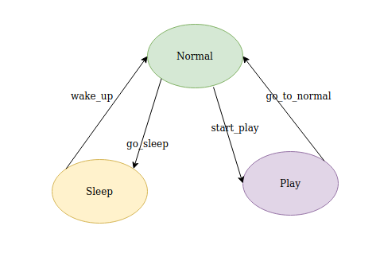

# Experimental_Robotics_Assignment2
# Experimental_Robotics_Assignment3

February 25, 2020

## Index

* [Introduction](#S-Introduction)
* [Software Architecture](#S-Sofar)
* [Packages and Files List](#S-PFL)
* [Installation and Running Procedure](#S-IRP)
* [Working Hypothesis](#S-WH)
* [System’s Features](#S-SF)
* [System’s Limitations and Possible Technical Improvements](#S-SL)
* [Authors and Contacts](#S-AC)

# Introduction
The aim of this assignment is to implement three states of the robot which are Normal, Play and Sleep. We use smach_viewer in ROS to implement these behaviors and visualize the states. The world environment is provided with an open arena and a human model. The human is ixed in one of the corners of the arena. We have a ball that is controlled by the human for playing with the robot. The robot listens to the human commands and plays with the ball using camera sensor attached to its body.

# Software Architecture
## The State Machine Diagram
For implementing the concept, we can see the finite state machine diagram in the image below. Here, there are three states of the robot. The transitions are mentioned in the image. As, the find algorithm could not be implemented successfully, it is not shown in the image.

* Normal - This state has two possible transitions "go_sleep" and "start_play"
* Play - This state has one outcome where it goes back to the normal state with transition "go_to_normal". 
* Sleep - This state also has one tansition where it goes to normal state with "wake_up"

## Component Diagram
The following figure illustrates how the idea was supposed to be implemented. There are four ROS nodes. The node *human_command* publishes the string rostopic */command* which is subscribes by the *state_behavior*. Similarly, the node "robot_following" subscribes to camera sensor images and searches for the balls. Once, the ball is detected it follows the ball when it is at rest or moving. Lastly, the node "state_behavior" apply the three finite states using the above nodes and their information. The node "go_to_point_ball" and "go_to_point_robot" are used to give the desired coordinates command for moving the robot and the ball. 

### The Messages 
This package has some messages which are described in the following.
* geometry_messages/Point - It is used for the x,y coordinate of the robot.
* std_msgs/Bool - To check if the robot has reached the position or not.
* std_msgs/String - To receive the command from person to play with the robot.
* sensor_msgs CompressedImage - To get and show the image using opencv.
* geometry_msgs Twist - To publish robot velocities to green ball.

*Action server - Planning Action. The action file is available in action/ folder. The aim is to move the robot and ball to a defined location. It is used in Normal state of the robot and to move the ball in the arena.

### The Parameters
The following parameters are launched from the launch file. These can be altered using the launch file in launch/main.launch thus allowing flexibility.
* home_x and home_y: These define the SLEEP coordinates of the behavior. The robot goes to this position when it is tired.
* tireness_level: This defines the threshold of the robot when it is under any state. 

# Packages and Files List

There are four packages in python, which are *human_command.py*, *robot_following.py*, *state_behavior.py* and "go_to_point.py" under scripts/ folder.

The doc folder contains the sphinx file as well as the index.html file which can be used to see the documentation in the browser.

# Installation and Running Procedure
Firstly, the repository should be cloned into the ROS workspace with the command

    git clone https://github.com/RohitK14/Experimental_Robotics_Assignment2.git
    
As the state machine is implemented using smach_viewer, we need to install it, if it is not available.

    sudo apt-get install ros-<melodic>-smach-viewer

where <meldoc> is the ROS distribution in the system. 

Now, we need to build the workspace. It can be done using catkin build command. In the workspace, use catkin build

    catkin build

The python scripts are not executable. Hence, go to exp_assignment3-main/scripts folder and run the following command to make it executatble,

    chmod +x state_behavior.py
    chmod +x human_command.py
    chmod +x robot_following.py
    chmod +x go_to_point_robot.py
    chmod +x go_to_point_ball.py

To run the application, we can run it using the single launch file,

    roslaunch exp_assignment2 gazebo_world.launch

In order to see the documentation, there is an html file in the doc folder. To see the documentation we run,

    firefox builds/html/index.html 

# Working Hypothesis and Environment
The hypothesis that is considered here is that the robot starts in the NORMAL state. When the robot is randomly moving in the 2D environment using action server, it gets tired. We have a parameter that decided the tireness level. If the level is 5, the robot reaches 5 positions and goes to SLEEP state. The sleep state is considered to be at one corner of the arena which can be changed using the parameters. The robot sleeps for 10 seconds as per our hypothesis.

The robot goes between these two states unless the user throw the ball in the arena. The ball is initially under the gound such that the robot cannot see the ball in the environment. Whenever, the user wants to play, the ball is made visible in the environment using human_command. The person position is fixed. The robot while moving in the environment notices the ball. Then, all the goals in the action server are cancelled and the robot relies only on the camera sensor attached to the link on its body. Now, the robot follows the ball using the camera information. As soon as it reaches the ball, the robot stops and moves its camera link or neck in clockwise and anti-clockwise direction for 45 degrees. When the ball in not in the camera frame, the robot shifts to NORMAL state. The camera prcesses the images using open cv libraries.

# System’s features
* All states and information available on the terminal where we launch the file.
* All files launched through a single launch file.
* The ball is moved in the environment at random time intervals. 
* The ball is made invisible my moving in below the ground.
* smach_viewer for visualising the states.
* The priority is given to play state to detect the ball.

# System’s limitations and Possible Technical Improvements
* When the robot moves its neck, it sometimes loses the image of the ball. And shifts back to Normal state.
* The serach for the ball for sometime after it has sensed the ball is not working properly.
* The possible improvement in this case can be to use global variables for the information.

# Authors and Contacts
This project was relized by Rohit Kumar

University email s5089482@studenti.unige.it
gmail: rohitkb114@gmail.com
